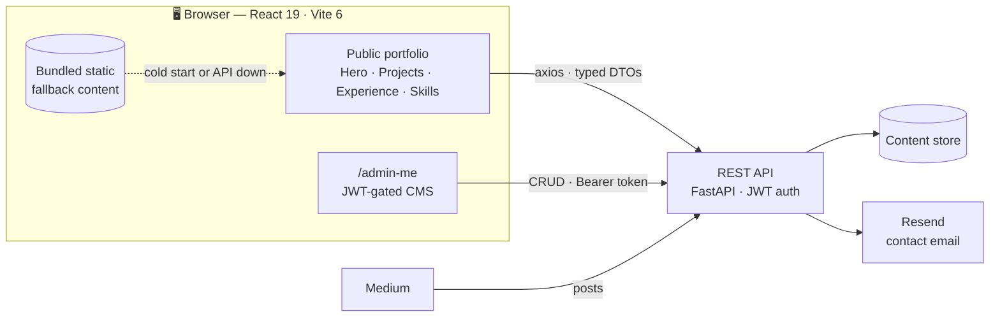

<div align="center">


<br/>

[](https://alkairis.github.io)
[](https://www.linkedin.com/in/alkairis/)
[](https://alkairis.medium.com)
[](https://x.com/alkairis_)

<br/>

> ### *Shipping RAG pipelines, agentic workflows, and cloud-native systems that solve real problems at scale.*

</div>

---

## 🧠 whoami

**Deepak Singh Rajput** — Senior Software Engineer, India · IST (UTC+5:30).

Four-plus years at [Impetus Technologies](https://www.impetus.com/) building **production** Generative AI — retrieval pipelines that stay accurate on real corpora, agentic LLM workflows that don't fall over on the third tool call, and the data platform migrations underneath them. **GCP Generative AI Leader certified.**

The parts I care about: grounding retrieval so it actually retrieves, keeping agent graphs debuggable, and the unglamorous cost/latency/reliability work that decides whether an LLM feature survives contact with production.

| Domain | Stack |
|---|---|
| 🤖 **GenAI** | LangChain · LangGraph · RAG pipelines · Agentic workflows · Function calling · Prompt engineering · Vector embeddings · LangSmith · MCP · Hugging Face · Ollama |
| 🧮 **Vector & Data** | FAISS · Chroma · Pinecone · PostgreSQL · MySQL · MongoDB · Redis |
| ☁️ **Cloud** | BigQuery · Dataproc · Cloud Composer · Cloud Run · GCS · Artifact Registry · Cloud Functions · Cloud Secrets · AWS |
| 🐍 **Languages** | Python (OOP · async) · TypeScript · SQL |
| ⚙️ **Frameworks** | FastAPI · Pydantic · REST · React |
| 🔧 **DevOps** | Terraform · Docker · Git · uv |

**Awards** — Excellence Award, Transformational Performance (Impetus, 2026) · iAppreciate Award (Impetus, 2026)

**Certifications** — GCP Generative AI Leader (Google Cloud, 2025) · HuggingFace AI Agents (2025) · GenAI Fundamentals (Databricks, 2024) · Associate Cloud Engineer (Google Cloud, 2023)

---

## 🏗️ This repo: the portfolio as a system

Most portfolios are a static page with the content hardcoded in JSX. This one is a **React front end over a real REST API**, with its own JWT-gated CMS — so updating a project or a certification is a form submission, not a commit and redeploy.



> **Note** — the API is a separate service and isn't in this repo. The front end falls back to bundled static content without it, so `npm run dev` works standalone.

---

## 🛠️ Stack

<div align="center">


</div>

- **Rendering** — React 19, Vite 6, client-side routing via React Router 7
- **Styling** — Tailwind v4 (`@tailwindcss/vite`) + hand-authored CSS for the glass/glow surfaces
- **State & data** — Zustand stores with in-flight request de-duplication, axios client with JWT interceptors
- **Motion** — GSAP + ScrollTrigger for scroll reveals; `@react-three/fiber` for the hero field; a hand-ported WebGL fluid solver for the cursor
- **CI/CD** — GitHub Actions → GitHub Pages, with `npm ci`, a `tsc --noEmit` gate, and a reproducible lockfile

---

## 🚀 Running it locally

```bash
git clone https://github.com/alkairis/alkairis.github.io.git
cd alkairis.github.io
npm install
npm run dev          # http://localhost:5173
```

| Script | What it does |
|---|---|
| `npm run dev` | Vite dev server, proxying `/api` and `/blog` to `localhost:8080` |
| `npm run build` | Production build to `dist/` |
| `npm run typecheck` | `tsc --noEmit` over the TypeScript layer |
| `npm run lint` | ESLint, including the React Hooks rules |
| `npm run preview` | Serve the production build locally |

Without a backend running, every section falls back to its bundled content — so the site is fully browsable out of the box.

<details>
<summary><b>Environment variables</b> (all optional — the app tolerates missing values)</summary>

<br/>

| Variable | Purpose | Default |
|---|---|---|
| `VITE_API_BASE_URL` | Backend origin | `/` (same-origin; dev proxies to `:8080`) |
| `VITE_API_TIMEOUT_MS` | Request timeout | `15000` |
| `VITE_BASE` | Public base path override | `/` |

</details>

---

## 📁 Layout

```text
src/
├─ api/          typed axios client — DTOs, domain types, JWT interceptors
├─ sections/     page sections (Hero, Projects, Experience, Skills, …)
├─ components/   reusable UI — modals, buttons, WebGL field, cursor
├─ stores/       Zustand stores with request de-duplication
├─ constants/    nav config + static fallback content
├─ pages/        JWT-gated admin CMS routes
└─ hooks/        shared data hooks (module-cached)
```

---

## 📝 License

[MIT](LICENSE) — use it as reference or inspiration, but please don't deploy it as-is with my name, photo, or personal content. Build your own story.

<div align="center">
<br/>

**Built with ☕ and too many `console.log`s**

[](https://alkairis.github.io)

*If this was useful, a ⭐ goes a long way.*

</div>
