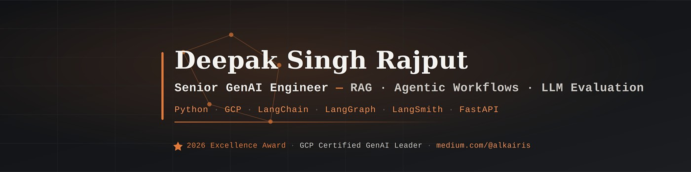

<div align="center">



<!-- ### ✦ Personal Portfolio — [alkairis.github.io](https://alkairis.github.io) -->

<br/>

[](https://alkairis.github.io)
[](https://www.linkedin.com/in/alkairis/)
[](https://alkairis.medium.com)
[](https://x.com/alkairis_)

<br/>

> *"Shipping RAG pipelines, agentic workflows, and cloud-native systems that solve real problems at scale."*

</div>

---

## 🧠 About Me

**Deepak Singh Rajput** — Senior Software Engineer based in **Indore, Madhya Pradesh, India**.

4+ years at [Impetus Technologies](https://www.impetus.com/) shipping production-grade Generative AI systems — RAG pipelines and agentic LLM workflows (LangChain · LangGraph) — and migrating large-scale on-prem data workloads to GCP. **GCP Generative AI Leader certified.**

| Domain | Stack |
|---|---|
| 🤖 AI / GenAI | LangChain · LangGraph · HuggingFace · Ollama · RAG Pipelines · Agentic AI · Prompt Engineering · Function Calling · Vector Embeddings · LangSmith · MCP Protocol |
| ☁️ GCP | BigQuery · GCS · Dataproc · Cloud Composer · Cloud Run · Artifact Registry · Deployment Manager · Cloud Secrets · Cloud Functions |
| 🐍 Languages | Python (OOP · Async) · TypeScript · SQL |
| ⚙️ Frameworks | FastAPI · ReactJS · Pydantic · REST APIs |
| 🗄️ Databases | MySQL · PostgreSQL · FAISS · Chroma · Pinecone |
| 🔧 DevOps | Terraform · Docker · Git · uv · venv |

---

## 🏆 Awards & Certifications

**Awards**
- **Excellence Award — Transformational Performance** · Impetus Technologies, 2026
- **iAppreciate Award** · Impetus Technologies, 2026

**Certifications**
- GCP Generative AI Leader · Google Cloud, 2025
- HuggingFace AI Agents · Hugging Face, 2025
- GenAI Fundamentals · Databricks, 2024
- Associate Cloud Engineer · Google Cloud, 2023

---

## 🛠️ Portfolio Site — Tech Stack

<div align="center">


</div>

---

## ✨ Features

- 🌌 Animated constellation canvas (Canvas 2D)
- 🔮 Mouse-tracking glow border cards
- 💫 Floating 3D tech skill orbs (Three.js)
- ⚡ GSAP scroll-triggered timeline animations
- ✍️ Live Medium RSS blog feed
- 📬 Working contact form via EmailJS
- 🔤 Typewriter name animation
- 📱 Fully responsive with mobile nav drawer

---

## 🚀 Getting Started

```bash
git clone https://github.com/alkairis/alkairis.dev.git
cd alkairis.dev
npm install

cp .env.example .env   # add your EmailJS credentials

npm run dev             # start dev server
npm run build           # production build → dist/
npm run lint             # ESLint check
```

### Environment Variables

```env
VITE_APP_EMAILJS_SERVICE_ID=your_service_id
VITE_APP_EMAILJS_TEMPLATE_ID=your_template_id
VITE_APP_EMAILJS_PUBLIC_KEY=your_public_key
```

Get these from [emailjs.com](https://www.emailjs.com/).

---

## 📝 License

Licensed under the [MIT License](LICENSE) — feel free to use this as a reference or inspiration, but please don't deploy it as-is with my name, photo, or personal content. Build your own story.

---

<div align="center">

**Built with ☕ from Indore, India**

[](https://alkairis.github.io)

*If this helped you, a ⭐ on the repo goes a long way.*

</div>
